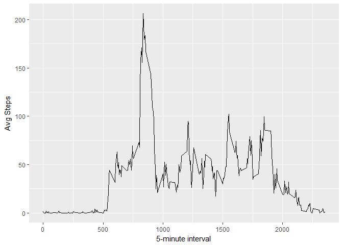

# Reproducible Research: Peer Assessment 1


## Loading and preprocessing the data
Course Project 1 - Reproducible Research  
Downloading and  Unziping File  
Loading Data  

```r
setwd("C:/Users/Marcelo/Desktop/Coursera/Data-Science-Specialization/RepData_PeerAssessment1/")
url <- "https://d396qusza40orc.cloudfront.net/repdata%2Fdata%2Factivity.zip"
download.file(url,"activity.zip", method = "auto")
unzip("activity.zip")
data <- read.csv("activity.csv", header = TRUE, stringsAsFactors = FALSE)
str(data)
```

```
## 'data.frame':	17568 obs. of  3 variables:
##  $ steps   : int  NA NA NA NA NA NA NA NA NA NA ...
##  $ date    : chr  "2012-10-01" "2012-10-01" "2012-10-01" "2012-10-01" ...
##  $ interval: int  0 5 10 15 20 25 30 35 40 45 ...
```

```r
summary(data)
```

```
##      steps            date              interval     
##  Min.   :  0.00   Length:17568       Min.   :   0.0  
##  1st Qu.:  0.00   Class :character   1st Qu.: 588.8  
##  Median :  0.00   Mode  :character   Median :1177.5  
##  Mean   : 37.38                      Mean   :1177.5  
##  3rd Qu.: 12.00                      3rd Qu.:1766.2  
##  Max.   :806.00                      Max.   :2355.0  
##  NA's   :2304
```

## What is mean total number of steps taken per day?

```r
library(dplyr)
```

```
## 
## Attaching package: 'dplyr'
```

```
## The following objects are masked from 'package:stats':
## 
##     filter, lag
```

```
## The following objects are masked from 'package:base':
## 
##     intersect, setdiff, setequal, union
```

```r
#For this part of the assignment, you can ignore the missing values in the 
# dataset.
data$date <- as.Date(data$date)
steps_per_day <- data %>%
        group_by(date)%>%
        summarise(total_steps = sum(steps, na.rm = TRUE))
steps_per_day
```

```
## # A tibble: 61 × 2
##          date total_steps
##        <date>       <int>
## 1  2012-10-01           0
## 2  2012-10-02         126
## 3  2012-10-03       11352
## 4  2012-10-04       12116
## 5  2012-10-05       13294
## 6  2012-10-06       15420
## 7  2012-10-07       11015
## 8  2012-10-08           0
## 9  2012-10-09       12811
## 10 2012-10-10        9900
## # ... with 51 more rows
```

```r
library(ggplot2)
# Make a histogram of the total number of steps taken each day
ggplot(steps_per_day, aes(x = date, y = total_steps))+
        geom_bar(stat = "identity", col = "black", fill = "gray")+
        xlab("Days")+
        ylab("Total Steps")+
        ggtitle("Total Number of Steps Taken Each Day")
```

<!-- -->

Calculate and report the mean and median total number of steps taken per day


```r
mean_median_steps <- data %>%
        group_by(date) %>%
        summarise(mean = mean(steps, na.rm = FALSE),
                  median = median(steps, na.rm = FALSE))
mean_median_steps 
```

```
## # A tibble: 61 × 3
##          date     mean median
##        <date>    <dbl>  <dbl>
## 1  2012-10-01       NA     NA
## 2  2012-10-02  0.43750      0
## 3  2012-10-03 39.41667      0
## 4  2012-10-04 42.06944      0
## 5  2012-10-05 46.15972      0
## 6  2012-10-06 53.54167      0
## 7  2012-10-07 38.24653      0
## 8  2012-10-08       NA     NA
## 9  2012-10-09 44.48264      0
## 10 2012-10-10 34.37500      0
## # ... with 51 more rows
```

## What is the average daily activity pattern?

```r
min_5_int <- data %>%
        group_by(interval)%>%
        summarise(avg = mean(steps, na.rm = TRUE))

ggplot(min_5_int, aes(x = interval, y = avg))+
        geom_line()+
        xlab("5-minute interval")+
        ylab("Avg Steps")
```

<!-- -->

```r
# Which 5-minute interval, on average across all the days in the dataset,
# contains the maximum number of steps?        

min_5_int$interval[which.max(min_5_int$avg)]
```

```
## [1] 835
```

## Imputing missing values

```r
# Calculate and report the total number of missing values in the dataset 
# (i.e. the total number of rows with NAs)
sum(is.na(data))
```

```
## [1] 2304
```

```r
data_copy <- data #keeping original dataset
NAs <- is.na(data_copy$steps)
avg_int <- tapply(data_copy$steps, data_copy$interval, mean, 
                  na.rm = TRUE, simplify = TRUE)
data_copy$steps[NAs] <- avg_int[as.character(data_copy$interval[NAs])]
```


```r
steps_per_day_2 <- data_copy %>%
        group_by(date)%>%
        summarise(total_steps = sum(steps, na.rm = TRUE))
steps_per_day_2
```

```
## # A tibble: 61 × 2
##          date total_steps
##        <date>       <dbl>
## 1  2012-10-01    10766.19
## 2  2012-10-02      126.00
## 3  2012-10-03    11352.00
## 4  2012-10-04    12116.00
## 5  2012-10-05    13294.00
## 6  2012-10-06    15420.00
## 7  2012-10-07    11015.00
## 8  2012-10-08    10766.19
## 9  2012-10-09    12811.00
## 10 2012-10-10     9900.00
## # ... with 51 more rows
```

```r
# Make a histogram of the total number of steps taken each day
ggplot(steps_per_day_2, aes(x = date, y = total_steps))+
        geom_bar(stat = "identity", col = "black", fill = "gray")+
        xlab("Days")+
        ylab("Total Steps")+
        ggtitle("Total Number of Steps Taken Each Day")
```

<!-- -->

```r
# Calculate and report the mean and median total number of steps taken per day

mean_median_steps_2 <- data_copy %>%
        group_by(date) %>%
        summarise(mean = mean(steps, na.rm = FALSE),
                  median = median(steps, na.rm = FALSE))
mean_median_steps_2 
```

```
## # A tibble: 61 × 3
##          date     mean   median
##        <date>    <dbl>    <dbl>
## 1  2012-10-01 37.38260 34.11321
## 2  2012-10-02  0.43750  0.00000
## 3  2012-10-03 39.41667  0.00000
## 4  2012-10-04 42.06944  0.00000
## 5  2012-10-05 46.15972  0.00000
## 6  2012-10-06 53.54167  0.00000
## 7  2012-10-07 38.24653  0.00000
## 8  2012-10-08 37.38260 34.11321
## 9  2012-10-09 44.48264  0.00000
## 10 2012-10-10 34.37500  0.00000
## # ... with 51 more rows
```

```r
summary(steps_per_day)
```

```
##       date             total_steps   
##  Min.   :2012-10-01   Min.   :    0  
##  1st Qu.:2012-10-16   1st Qu.: 6778  
##  Median :2012-10-31   Median :10395  
##  Mean   :2012-10-31   Mean   : 9354  
##  3rd Qu.:2012-11-15   3rd Qu.:12811  
##  Max.   :2012-11-30   Max.   :21194
```

```r
summary(steps_per_day_2)
```

```
##       date             total_steps   
##  Min.   :2012-10-01   Min.   :   41  
##  1st Qu.:2012-10-16   1st Qu.: 9819  
##  Median :2012-10-31   Median :10766  
##  Mean   :2012-10-31   Mean   :10766  
##  3rd Qu.:2012-11-15   3rd Qu.:12811  
##  Max.   :2012-11-30   Max.   :21194
```

```r
# Using the approach of subs NAs by its interval mean, the Mean increased by 15%
# and and the 1st Quantile by 50%.
```

## Are there differences in activity patterns between weekdays and weekends?

```r
# Creating new factor variable using ifelse and weekdays() 
data_copy <- data_copy%>%
        mutate(wdays = ifelse(weekdays(data_copy$date) == "sábado" |
                                      weekdays(data_copy$date) == "domingo",
                              "Weekends", "Weekday"))
steps_per_weekdays <- data_copy %>%
        group_by(wdays, interval)%>%
        summarise(avg_steps = mean(steps, na.rm = TRUE))
steps_per_weekdays
```

```
## Source: local data frame [576 x 3]
## Groups: wdays [?]
## 
##      wdays interval  avg_steps
##      <chr>    <int>      <dbl>
## 1  Weekday        0 2.25115304
## 2  Weekday        5 0.44528302
## 3  Weekday       10 0.17316562
## 4  Weekday       15 0.19790356
## 5  Weekday       20 0.09895178
## 6  Weekday       25 1.59035639
## 7  Weekday       30 0.69266247
## 8  Weekday       35 1.13794549
## 9  Weekday       40 0.00000000
## 10 Weekday       45 1.79622642
## # ... with 566 more rows
```

```r
ggplot(steps_per_weekdays, aes(x = interval, y = avg_steps))+
        geom_line()+
        xlab("5-minute interval")+
        ylab("Average # Steps")+
        facet_grid(wdays~.)
```

<!-- -->
